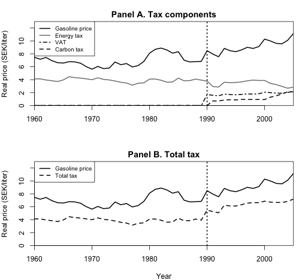
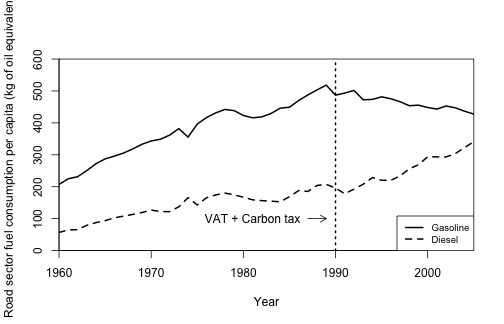
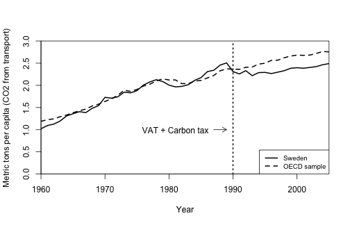
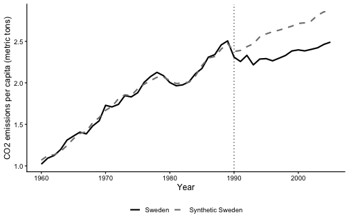
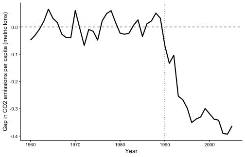
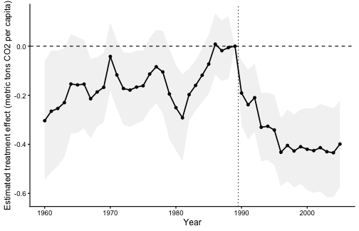
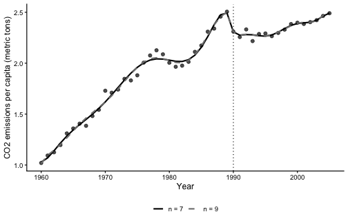

---

# Descriptive Statistics

## Figures 1–3

**Figure 1** shows the real gasoline price and its tax components in Sweden from 1960 to 2005, measured in 2005 SEK per liter. Panel A overlays the retail gasoline price with the energy tax, VAT, and carbon tax, closely following the layout in the paper. Panel B compares the gasoline price with the total tax component alone. The dominant tax wedge before 1990 is the energy tax; after 1990, VAT and the carbon tax appear and push the total tax burden upward.

Gasoline price components in Sweden, 1960--2005, measured in 2005 SEK per liter. Panel A shows the gasoline price and tax components. Panel B shows the gasoline price and total tax. The dotted vertical line marks 1990.

**Figure 2** plots road-sector fuel consumption per capita in Sweden from 1960 to 2005, measured in kilograms of oil equivalent. Gasoline consumption rises steadily through the 1980s, peaks around 1989–1990, and then declines sharply after the tax reform. Diesel consumption continues rising, consistent with substitution toward diesel vehicles.

Road-sector fuel consumption per capita in Sweden, 1960--2005, measured in kilograms of oil equivalent. The dotted vertical line marks 1990.

**Figure 3** plots per-capita CO~2~ emissions from transport for Sweden and the OECD donor-sample average from 1960 to 2005. Before 1990, the two series track each other reasonably closely, though Sweden rises somewhat faster in the late 1980s. After 1990, Sweden's emissions flatten and then decline while the OECD average continues upward, foreshadowing the treatment effects estimated below.

Per-capita CO2 emissions from transport in Sweden and the OECD donor-sample average, 1960--2005. The dotted vertical line marks 1990.

---

# Synthetic Control Method

## Implementation and Figures 4–5 {#sec-synth}

The synthetic control method constructs a weighted combination of control countries — "synthetic Sweden" — that minimises the pre-treatment mean squared prediction error (MSPE) between the treated unit and the synthetic counterfactual. Formally, let $\mathbf{W} = (w_1, \ldots, w_J)'$ with $w_j \geq 0$ and $\sum_j w_j = 1$ be the vector of donor weights. The estimator solves:

$$\min_{\mathbf{W}} \sum_{t < t^*} \left(Y_{Sweden,t} - \sum_{j \neq Sweden} w_j Y_{jt}\right)^2$$

subject to the constraint that the synthetic control also matches a vector of pre-treatment predictor averages. The treatment effect in each post-treatment year is:

$$\hat{\tau}_t = Y_{Sweden,t} - \sum_{j \neq Sweden} \hat{w}_j Y_{jt}, \quad t \geq t^*$$

Using 14 OECD donor countries, the outcome variable `CO2_transport_capita`, and predictors GDP per capita, gasoline consumption per capita, motor vehicles per capita, and urban population share, averaged over 1980–1989. Special predictors equal the CO~2~ level in 1989, 1980, and 1970. The MSPE is minimised over the full pre-treatment period 1960–1989.

**Table 1** reports the predictor means for Sweden, synthetic Sweden, and the OECD donor sample (population-weighted). All continuous predictors are averaged over 1980–1989; the lagged CO~2~ values are point estimates at 1989, 1980, and 1970. Under the paper's original specification, synthetic Sweden closely matches Sweden on all predictors except gasoline consumption per capita.

<table class="table" style="font-size: 9px; width: auto !important; margin-left: auto; margin-right: auto;border-bottom: 0;">
<caption style="font-size: initial !important;">CO2 Emissions from Transport Predictor Means before Tax Reform</caption>
 <thead>
  <tr>
   <th style="text-align:left;"> Variables </th>
   <th style="text-align:center;"> Sweden </th>
   <th style="text-align:center;"> Synth. Sweden </th>
   <th style="text-align:center;"> OECD sample </th>
  </tr>
 </thead>
<tbody>
  <tr>
   <td style="text-align:left;width: 2.45in; "> GDP per capita </td>
   <td style="text-align:center;width: 0.8in; "> 20,121.5 </td>
   <td style="text-align:center;width: 0.8in; "> 20,121.2 </td>
   <td style="text-align:center;width: 0.8in; "> 21,274.4 </td>
  </tr>
  <tr>
   <td style="text-align:left;width: 2.45in; "> Motor vehicles (per 1,000 people) </td>
   <td style="text-align:center;width: 0.8in; "> 405.6 </td>
   <td style="text-align:center;width: 0.8in; "> 406.8 </td>
   <td style="text-align:center;width: 0.8in; "> 517.5 </td>
  </tr>
  <tr>
   <td style="text-align:left;width: 2.45in; "> Gasoline consumption per capita </td>
   <td style="text-align:center;width: 0.8in; "> 456.2 </td>
   <td style="text-align:center;width: 0.8in; "> 406.2 </td>
   <td style="text-align:center;width: 0.8in; "> 679.0 </td>
  </tr>
  <tr>
   <td style="text-align:left;width: 2.45in; "> Urban population </td>
   <td style="text-align:center;width: 0.8in; "> 83.1 </td>
   <td style="text-align:center;width: 0.8in; "> 83.1 </td>
   <td style="text-align:center;width: 0.8in; "> 74.1 </td>
  </tr>
  <tr>
   <td style="text-align:left;width: 2.45in; "> CO2 from transport per capita 1989 </td>
   <td style="text-align:center;width: 0.8in; "> 2.5 </td>
   <td style="text-align:center;width: 0.8in; "> 2.5 </td>
   <td style="text-align:center;width: 0.8in; "> 3.5 </td>
  </tr>
  <tr>
   <td style="text-align:left;width: 2.45in; "> CO2 from transport per capita 1980 </td>
   <td style="text-align:center;width: 0.8in; "> 2.0 </td>
   <td style="text-align:center;width: 0.8in; "> 2.0 </td>
   <td style="text-align:center;width: 0.8in; "> 3.2 </td>
  </tr>
  <tr>
   <td style="text-align:left;width: 2.45in; "> CO2 from transport per capita 1970 </td>
   <td style="text-align:center;width: 0.8in; "> 1.7 </td>
   <td style="text-align:center;width: 0.8in; "> 1.7 </td>
   <td style="text-align:center;width: 0.8in; "> 2.8 </td>
  </tr>
</tbody>
<tfoot>
<tr><td style="padding: 0; " colspan="100%">Notes:</td></tr>
<tr><td style="padding: 0; " colspan="100%">
 All variables except lagged CO2 are averaged for the period 1980--1989. GDP per capita is purchasing power parity (PPP)-adjusted and measured in 2005 US dollars. Gasoline consumption is measured in kilograms of oil equivalent. Urban population is measured as percentage of total population. CO2 emissions are measured in metric tons. The last column reports the population-weighted averages of the 14 OECD countries in the donor pool.</td></tr>
</tfoot>
</table>

**Table 2** reports the donor country weights. The synthetic Sweden is best reproduced by Denmark (largest weight), Belgium, New Zealand, Greece, the United States, and Switzerland; all other countries receive zero or near-zero weight.

<table class="table" style="font-size: 9px; width: auto !important; margin-left: auto; margin-right: auto;border-bottom: 0;">
<caption style="font-size: initial !important;">Country Weights in Synthetic Sweden</caption>
 <thead>
  <tr>
   <th style="text-align:left;"> Country </th>
   <th style="text-align:center;"> Weight </th>
   <th style="text-align:left;"> Country </th>
   <th style="text-align:center;"> Weight </th>
  </tr>
 </thead>
<tbody>
  <tr>
   <td style="text-align:left;width: 1.45in; "> Australia </td>
   <td style="text-align:center;width: 0.7in; "> 0.001 </td>
   <td style="text-align:left;width: 1.45in; "> Japan </td>
   <td style="text-align:center;width: 0.7in; "> 0.000 </td>
  </tr>
  <tr>
   <td style="text-align:left;width: 1.45in; "> Belgium </td>
   <td style="text-align:center;width: 0.7in; "> 0.195 </td>
   <td style="text-align:left;width: 1.45in; "> New Zealand </td>
   <td style="text-align:center;width: 0.7in; "> 0.177 </td>
  </tr>
  <tr>
   <td style="text-align:left;width: 1.45in; "> Canada </td>
   <td style="text-align:center;width: 0.7in; "> 0.000 </td>
   <td style="text-align:left;width: 1.45in; "> Poland </td>
   <td style="text-align:center;width: 0.7in; "> 0.001 </td>
  </tr>
  <tr>
   <td style="text-align:left;width: 1.45in; "> Denmark </td>
   <td style="text-align:center;width: 0.7in; "> 0.384 </td>
   <td style="text-align:left;width: 1.45in; "> Portugal </td>
   <td style="text-align:center;width: 0.7in; "> 0.000 </td>
  </tr>
  <tr>
   <td style="text-align:left;width: 1.45in; "> France </td>
   <td style="text-align:center;width: 0.7in; "> 0.000 </td>
   <td style="text-align:left;width: 1.45in; "> Spain </td>
   <td style="text-align:center;width: 0.7in; "> 0.000 </td>
  </tr>
  <tr>
   <td style="text-align:left;width: 1.45in; "> Greece </td>
   <td style="text-align:center;width: 0.7in; "> 0.090 </td>
   <td style="text-align:left;width: 1.45in; "> Switzerland </td>
   <td style="text-align:center;width: 0.7in; "> 0.061 </td>
  </tr>
  <tr>
   <td style="text-align:left;width: 1.45in; "> Iceland </td>
   <td style="text-align:center;width: 0.7in; "> 0.001 </td>
   <td style="text-align:left;width: 1.45in; "> United States </td>
   <td style="text-align:center;width: 0.7in; "> 0.088 </td>
  </tr>
</tbody>
<tfoot>
<tr><td style="padding: 0; " colspan="100%">Note:</td></tr>
<tr><td style="padding: 0; " colspan="100%">
 With the synthetic control method, extrapolation is not allowed, so all weights are between 0 and 1 and sum to 1.</td></tr>
</tfoot>
</table>

Per-capita CO2 emissions from transport in Sweden and synthetic Sweden, 1960--2005. The dotted vertical line marks 1990.

Figure 4 shows that synthetic Sweden tracks actual Sweden closely through 1989. After 1990, Sweden's emissions fall below the counterfactual and the gap grows over time.

Gap in per-capita CO2 emissions from transport between Sweden and synthetic Sweden, 1960--2005. The dotted vertical line marks 1990.

Figure 5 shows the pre-treatment gap hovering around zero, confirming a good counterfactual match. After 1990 the gap turns persistently and increasingly negative, reaching approximately $-0.4$ metric tons per capita by 2005.

## Average Treatment Effect {#sec-ate-synth}

The average treatment effect in the post-treatment period is:

$$\widehat{\text{ATE}}_{SC} = \frac{1}{T_1}\sum_{t=1991}^{2005}\hat{\tau}_t = \frac{1}{15}\sum_{t=1991}^{2005}\left(Y_{Sweden,t} - \hat{Y}_{Synth,t}\right)$$

This yields $\widehat{\text{ATE}}_{SC} = -0.3$ metric tons CO~2~ per capita per year — approximately a **13%** reduction relative to Sweden's 1990 emission level of 2.31 metric tons per capita.

---

# Difference-in-Differences

## TWFE Model

The two-way fixed effects (TWFE) model is:

$$y_{ct} = \alpha D_{ct} + \beta_c + \gamma_t + \varepsilon_{ct}$$

where $y_{ct}$ is CO~2~ emissions from transport for country $c$ in year $t$, $D_{ct} = \mathbf{1}[c = \text{Sweden},\; t \geq 1990]$ is the treatment indicator, $\beta_c$ are country fixed effects, and $\gamma_t$ are year fixed effects. The model is estimated on all 15 countries and 46 years (690 observations).

## Point Estimates and Standard Errors {#sec-did}

<table class="table" style="font-size: 9px; width: auto !important; margin-left: auto; margin-right: auto;">
<caption style="font-size: initial !important;">TWFE estimates with alternative standard errors.</caption>
 <thead>
  <tr>
   <th style="text-align:left;"> SE Type </th>
   <th style="text-align:center;"> Estimate </th>
   <th style="text-align:center;"> Std. Error </th>
   <th style="text-align:center;"> t-stat </th>
   <th style="text-align:center;"> p-value </th>
  </tr>
 </thead>
<tbody>
  <tr>
   <td style="text-align:left;"> Conventional (i.i.d.) </td>
   <td style="text-align:center;"> -0.2137 </td>
   <td style="text-align:center;"> 0.0771 </td>
   <td style="text-align:center;"> -2.77 </td>
   <td style="text-align:center;"> 0.0058 </td>
  </tr>
  <tr>
   <td style="text-align:left;"> Heteroskedasticity-Consistent (HC) </td>
   <td style="text-align:center;"> -0.2137 </td>
   <td style="text-align:center;"> 0.0319 </td>
   <td style="text-align:center;"> -6.70 </td>
   <td style="text-align:center;"> 0.0000 </td>
  </tr>
  <tr>
   <td style="text-align:left;"> Clustered by Year </td>
   <td style="text-align:center;"> -0.2137 </td>
   <td style="text-align:center;"> 0.0259 </td>
   <td style="text-align:center;"> -8.25 </td>
   <td style="text-align:center;"> 0.0000 </td>
  </tr>
  <tr>
   <td style="text-align:left;"> Two-Way Clustered (Country and Year) </td>
   <td style="text-align:center;"> -0.2137 </td>
   <td style="text-align:center;"> 0.0805 </td>
   <td style="text-align:center;"> -2.65 </td>
   <td style="text-align:center;"> 0.0082 </td>
  </tr>
</tbody>
</table>

The point estimate is $\hat{\alpha} = -0.214$ metric tons CO~2~ per capita per year across all four SE specifications. However, the standard errors differ by a factor of three across methods.

**Discussion of inference approaches.** *Conventional SEs* assume i.i.d. errors — implausible in panel data where emissions within a country are strongly serially correlated and global shocks (oil crises, recessions) induce cross-sectional correlation across countries. *HC SEs* correct for heteroskedasticity but not serial correlation or cross-sectional dependence; the unusually small SE (0.032, smaller than the conventional SE) is a warning sign of poor calibration in this setting. *Clustering by year* accounts for within-year cross-sectional correlation but ignores within-country serial correlation — a serious omission given that the treatment is a country-level intervention persisting over 15 years. *Two-way clustering* (country $\times$ year) is the most defensible conventional approach, accounting for both sources of dependence. The resulting SE (0.081) is the largest. With only 15 country clusters, the "few clusters" asymptotic approximation is borderline adequate; simulation evidence typically recommends at least 30–50 clusters.

**Alternative approach.** Given the single treated unit, Fisher-style permutation/placebo tests — as used by Andersson (2019) — are more appropriate. See Section 6(b).

## DiD vs. Synthetic Control {#sec-did-vs-sc}

The TWFE estimate ($\hat{\alpha} = -0.214$) is smaller in absolute magnitude than the synthetic control ATE ($-0.3$). Several factors explain this gap:

1. **Counterfactual construction.** The synthetic control explicitly matches Sweden's pre-treatment CO~2~ trajectory; the TWFE imposes equal weighting on all control countries (conditional on fixed effects), many of which have structurally different emission paths.
2. **Parallel trends.** Figure 3 shows that Sweden's pre-treatment emissions were diverging slightly from the OECD average in the late 1980s, casting doubt on the parallel trends assumption underlying TWFE. The synthetic control, by constructing a purpose-built counterfactual, is less exposed to this violation.
3. **Contamination.** TWFE gives implicit weight to poorly matching countries (e.g., Poland, with a very different economic trajectory), biasing the estimate toward zero.

## TWFE and the ATT {#sec-att}

In the canonical $2 \times 2$ DiD with a single treatment group and two periods, TWFE recovers the ATT under parallel trends. With one treated unit, many controls, and 16 post-treatment periods, TWFE estimates a time-average of the year-specific treatment effects:

$$\hat{\alpha} \approx \sum_{t \geq 1990} \omega_t \tau_t$$

where the weights $\omega_t$ are proportional to the within-cell variance of $D_{ct}$. Because there is **no staggered adoption** (Sweden is the only treated unit), the critique of Callaway and Sant'Anna (2021) and Goodman-Bacon (2021) — that TWFE may use already-treated units as controls — does not apply here. The relevant concern is solely whether the parallel trends assumption holds. As argued above, the pre-treatment evidence suggests it holds approximately but imperfectly, implying $\hat{\alpha}$ may not accurately recover the ATT for Sweden.

---

# Event Study

## Model

The event study allows treatment effects to vary by year:

$$y_{ct} = \sum_{\substack{t=1960 \\ t\neq 1989}}^{2005} \alpha_t D_{ct} + \beta_c + \gamma_t + \varepsilon_{ct}$$

where $D_{ct} = \mathbf{1}[c = \text{Sweden}]$ in year $t$ (and zero otherwise), and $\alpha_{1989} \equiv 0$ is the normalisation. The pre-treatment coefficients ($\hat{\alpha}_t$ for $t < 1989$) test the parallel trends assumption; systematic pre-trends would invalidate the DiD estimator.

## Results {#sec-es}

Event-study estimates for Sweden relative to 1989. The shaded band shows 95\% confidence intervals from heteroskedasticity-robust standard errors. The dotted vertical line marks 1990.

**Pre-treatment period.** The $\hat{\alpha}_t$ estimates for $t < 1989$ fluctuate around zero without a discernible systematic trend, providing some support for the parallel trends assumption. Confidence intervals are wide in early years, reflecting limited precision with one treated unit.

**Post-treatment period.** Coefficients become negative and grow in magnitude from 1990 onward, reaching approximately $-0.40$ to $-0.45$ metric tons per capita by 2004–2005. Most post-treatment estimates are statistically significant.

## Comparison to Andersson Figure 5

Qualitatively, the event study is consistent with Andersson's Figure 5 (the synthetic control gap plot): both show a near-zero effect before 1990 and a growing negative effect afterward. Key differences: (i) the event study estimates show more variability in the pre-treatment period, reflecting the noisier DiD counterfactual relative to the synthetic control; (ii) Andersson's gap is somewhat larger in post-treatment magnitude; (iii) the synthetic control pre-treatment gap is visibly tighter to zero — the purpose-built counterfactual provides a better pre-treatment fit than the DiD average.

---

# Regression Discontinuity in Time

## Model

The RDiT model uses only Swedish data and estimates:

$$y_t = \alpha_0 + \alpha D_t + \mathbf{1}\{t < 1990\}\sum_{k=1}^{n}\beta_k(1990-t)^k + \mathbf{1}\{t \geq 1990\}\sum_{k=1}^{n}\gamma_k(t-1990)^k + \varepsilon_t$$

where $D_t = \mathbf{1}[t \geq 1990]$. The two piecewise polynomial terms allow the trend to differ on either side of the cutoff. The intercept ($\alpha_0$) and the treatment effect ($\alpha$) capture the level of emissions and the discontinuous jump at 1990, respectively. Zeroth-order polynomial terms are omitted due to collinearity with $\alpha_0$ and $\alpha$.

## Sensitivity to Polynomial Degree {#sec-rdit-table}

<table class="table" style="font-size: 9px; width: auto !important; margin-left: auto; margin-right: auto;">
<caption style="font-size: initial !important;">RDiT estimates for polynomial degrees $n = 1, \ldots, 9$. Robust (HC1) standard errors throughout.</caption>
 <thead>
  <tr>
   <th style="text-align:center;"> Poly. Degree ($n$) </th>
   <th style="text-align:center;"> $\hat{\alpha}$ </th>
   <th style="text-align:center;"> Robust SE </th>
   <th style="text-align:center;"> $t$-stat </th>
   <th style="text-align:center;"> $p$-value </th>
  </tr>
 </thead>
<tbody>
  <tr>
   <td style="text-align:center;"> 1 </td>
   <td style="text-align:center;"> -0.2689 </td>
   <td style="text-align:center;"> 0.0448 </td>
   <td style="text-align:center;"> -6.00 </td>
   <td style="text-align:center;"> 0.0000 </td>
  </tr>
  <tr>
   <td style="text-align:center;"> 2 </td>
   <td style="text-align:center;"> -0.1081 </td>
   <td style="text-align:center;"> 0.0676 </td>
   <td style="text-align:center;"> -1.60 </td>
   <td style="text-align:center;"> 0.1177 </td>
  </tr>
  <tr>
   <td style="text-align:center;"> 3 </td>
   <td style="text-align:center;"> -0.2023 </td>
   <td style="text-align:center;"> 0.0637 </td>
   <td style="text-align:center;"> -3.17 </td>
   <td style="text-align:center;"> 0.0030 </td>
  </tr>
  <tr>
   <td style="text-align:center;"> 4 </td>
   <td style="text-align:center;"> -0.4050 </td>
   <td style="text-align:center;"> 0.0615 </td>
   <td style="text-align:center;"> -6.59 </td>
   <td style="text-align:center;"> 0.0000 </td>
  </tr>
  <tr>
   <td style="text-align:center;"> 5 </td>
   <td style="text-align:center;"> -0.4899 </td>
   <td style="text-align:center;"> 0.1170 </td>
   <td style="text-align:center;"> -4.19 </td>
   <td style="text-align:center;"> 0.0002 </td>
  </tr>
  <tr>
   <td style="text-align:center;"> 6 </td>
   <td style="text-align:center;"> -0.3009 </td>
   <td style="text-align:center;"> 0.0845 </td>
   <td style="text-align:center;"> -3.56 </td>
   <td style="text-align:center;"> 0.0012 </td>
  </tr>
  <tr>
   <td style="text-align:center;"> 7 </td>
   <td style="text-align:center;"> -0.0339 </td>
   <td style="text-align:center;"> 0.0949 </td>
   <td style="text-align:center;"> -0.36 </td>
   <td style="text-align:center;"> 0.7233 </td>
  </tr>
  <tr>
   <td style="text-align:center;"> 8 </td>
   <td style="text-align:center;"> -0.0070 </td>
   <td style="text-align:center;"> 0.1370 </td>
   <td style="text-align:center;"> -0.05 </td>
   <td style="text-align:center;"> 0.9599 </td>
  </tr>
  <tr>
   <td style="text-align:center;"> 9 </td>
   <td style="text-align:center;"> -0.2284 </td>
   <td style="text-align:center;"> 0.1533 </td>
   <td style="text-align:center;"> -1.49 </td>
   <td style="text-align:center;"> 0.1484 </td>
  </tr>
</tbody>
</table>

The estimates range from near zero ($n = 7,\, 8$) to $-0.490$ ($n = 5$), with no stable pattern. This extreme sensitivity to functional form is a fundamental concern for the RDiT design here.

## Graphical RD for $n = 7$ and $n = 9$ {#sec-rdit-plot}

Observed CO2 emissions in Sweden with degree-7 and degree-9 piecewise polynomial fits. The dotted vertical line marks 1990.

**$n = 7$:** The degree-7 polynomial fits the pre-treatment data reasonably well, but the two segments nearly meet at the cutoff, producing a near-zero estimate ($\hat{\alpha} = -0.034$, $p = 0.723$). The polynomial attributes most of the post-1990 decline to the continuation of the pre-treatment trend rather than a level shift.

**$n = 9$:** The degree-9 polynomial exhibits clear overfitting — visually erratic behaviour especially in the tails — and implies a larger but still statistically insignificant discontinuity ($\hat{\alpha} = -0.228$, $p = 0.148$). The wiggling near the cutoff is a classic sign that functional form, not a genuine level shift, is driving the result.

---

# Synthesis

## Identification

**Synthetic control — most credible.** The synthetic control is the most credible identification strategy. Its advantages are threefold: (i) the counterfactual is explicitly constructed to match Sweden's pre-treatment emissions trajectory, and its quality is directly verifiable from Figure 4; (ii) the donor weights are transparent and economically interpretable — Denmark and New Zealand, countries with similar economic structures and fuel demand, receive the largest weights; (iii) the pre-treatment gap in Figure 5 hovers near zero for 30 years, lending strong support to the identifying assumption that the synthetic control would have continued to track Sweden absent the carbon tax. The main limitation is the "no interference" assumption and the stability of the weighting relationship post-treatment; cross-border fuel tourism from Sweden to Norway or Denmark could slightly contaminate the donor countries, though the long-distance donors (New Zealand, USA) mitigate this concern.

**Event study — partially credible.** The event study is useful for testing the parallel trends assumption: the absence of a systematic pre-trend is a necessary (though not sufficient) condition for DiD validity. The pre-treatment coefficients do not display a clear trend, providing supporting evidence. However, with only one treated unit, the pre-trend test has low power, and the result should be interpreted as a complement to the synthetic control rather than a standalone identification strategy.

**DiD / TWFE — less credible.** The TWFE estimator requires Sweden to have followed the average trend of the other 14 OECD countries absent the tax. Figure 3 suggests Sweden's pre-treatment emissions were diverging from the OECD average in the late 1980s, a pre-trend divergence that weakens this assumption. The TWFE estimate of $-0.214$ is plausibly a downward-biased estimate of the ATT because the DiD counterfactual is imprecise.

**RDiT — least credible.** The RDiT is the least credible approach in this application. The key identifying assumption — that the only discontinuity in Sweden's CO~2~ time series at 1990 was caused by the carbon tax — is questionable, as Sweden's 1990 tax reform simultaneously restructured the energy tax, VAT, and carbon tax. More fundamentally, Table 4 shows that the treatment effect estimate varies from $-0.007$ to $-0.490$ as the polynomial degree changes from 8 to 5 — a range spanning an order of magnitude. With 46 observations and high-degree polynomials, the functional form is driving the results, not the data.

## Inference

**Andersson's approach — permutation/placebo tests.** Andersson (2019) conducts inference by repeating the synthetic control estimation for each of the 14 donor countries, as if each had been treated in 1990. The empirical distribution of post/pre-treatment MSPE ratios for the donor countries serves as the reference distribution under the null hypothesis of no treatment effect. The $p$-value is the proportion of donor countries whose MSPE ratio equals or exceeds Sweden's. This approach has several important advantages over conventional methods:

1. **Validity with one treated unit.** It does not require a large number of treated clusters or appeal to asymptotic theory — both of which fail when there is a single treated unit.
2. **Robustness.** It does not assume normality, homoskedasticity, or a specific error structure. It directly exploits the structure of the synthetic control estimator.
3. **Intuitive interpretation.** A country with a large post-treatment gap (relative to its pre-treatment fit quality) is a genuine outlier — the carbon tax had an unusually large effect on Sweden compared to what any donor country "would have" experienced.

The main limitation is low power when the donor pool is small: with 14 donor countries, the minimum achievable $p$-value is $1/15 \approx 0.067$, meaning a two-sided test at the 5% level is impossible regardless of the magnitude of the effect.

**Conventional cluster-robust SEs.** For the DiD and event study, two-way clustered SEs (country $\times$ year) are the most defensible conventional approach, but with 15 country clusters the asymptotic approximation is borderline adequate. Moreover, with a single treated country, the fundamental challenge is that there is effectively **one treated cluster** — clustering by country does not resolve the problem that all identification comes from a single unit. The dramatically different SEs across methods (0.026 to 0.081 for the same point estimate) illustrate the fragility of conventional inference in this setting.

**Are these approaches mutually exclusive?** No — they are complementary. Cluster-robust SEs characterize uncertainty around individual year-specific estimates in the event study and DiD. Permutation tests are better suited for the overall significance of the synthetic control treatment effect. A complete analysis would report both, acknowledge their respective limitations, and note that both lead to the same qualitative conclusion: the carbon tax significantly reduced Swedish transport emissions, with an effect in the range of $-0.21$ to $-0.30$ metric tons CO~2~ per capita per year.

**Overall conclusion.** All four methods point in the same direction. Sweden's 1991 carbon tax reduced per-capita transport CO~2~ emissions by approximately $0.21$–$0.30$ metric tons per capita per year — roughly 9–13% of Sweden's 1990 emission level. The synthetic control provides the most credible point estimate ($-0.301$) and Andersson's permutation-based inference is the most appropriate framework for a single treated unit. The DiD and event study provide corroborating evidence and a useful pre-trends check, while the RDiT results are too sensitive to functional form assumptions to be informative.

---

# References

Abadie, A., A. Diamond, and J. Hainmueller (2010). Synthetic control methods for comparative case studies: Estimating the effect of California's tobacco control program. *Journal of the American Statistical Association* 105(490), 493–505.

Abadie, A. and J. Gardeazabal (2003). The economic costs of conflict: A case study of the Basque Country. *American Economic Review* 93(1), 113–132.

Andersson, J. J. (2019). Carbon taxes and CO2 emissions: Sweden as a case study. *American Economic Journal: Economic Policy* 11(4), 1–30.

Callaway, B. and P. H. C. Sant'Anna (2021). Difference-in-differences with multiple time periods. *Journal of Econometrics* 225(2), 200–230.

Goodman-Bacon, A. (2021). Difference-in-differences with variation in treatment timing. *Journal of Econometrics* 225(2), 254–277.

Marcus, M. and P. H. C. Sant'Anna (2021). The role of parallel trends in event study settings: An application to environmental economics. *Journal of the Association of Environmental and Resource Economists* 8(2), 235–275.
